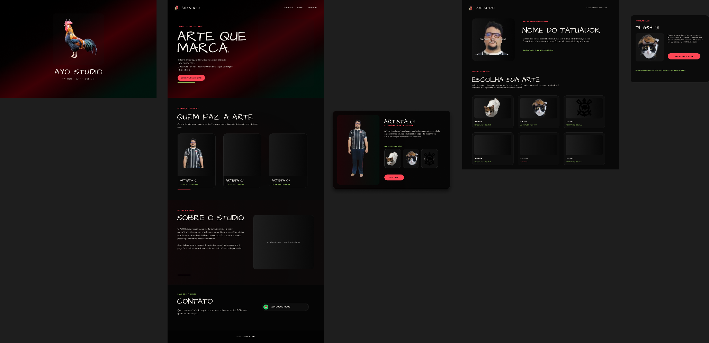
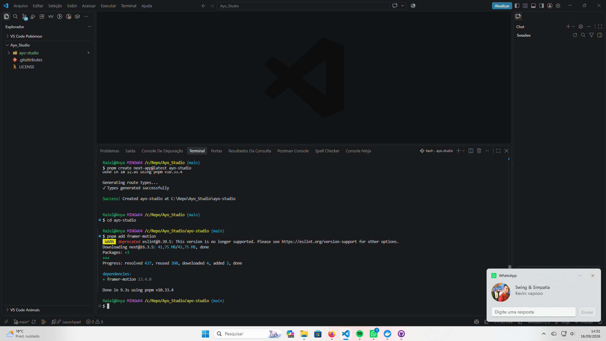
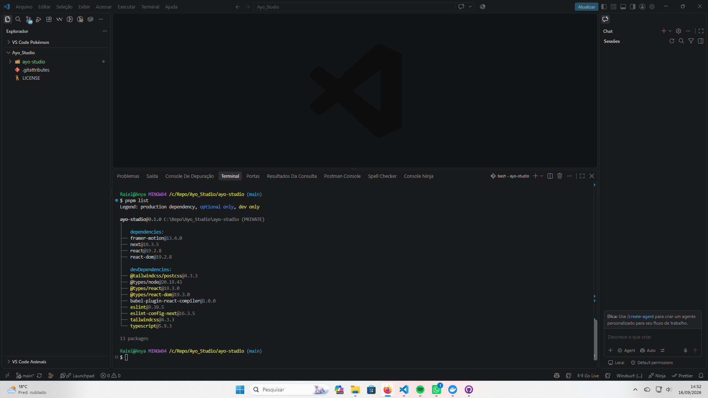
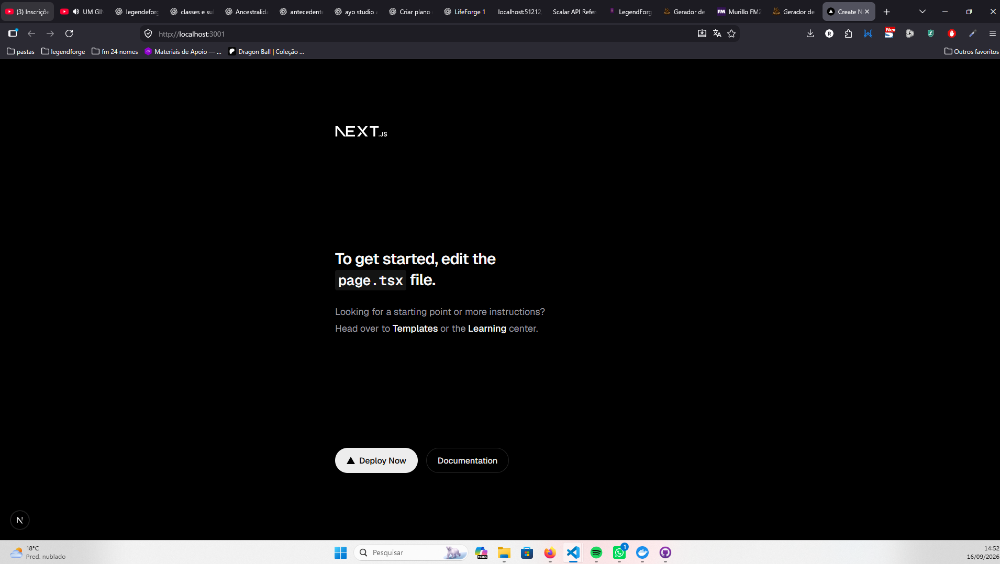

# AYŌ Studio — Figma References

> Referências visuais atuais do projeto.  
> O Figma ainda não está finalizado.

## 1. Visão geral atual



### Elementos já presentes
- Splash/logo;
- Home preliminar;
- Hero;
- seção de profissionais;
- Sobre o Studio;
- Contato;
- card/preview de artista;
- página individual de tatuador;
- grid de flashes;
- card/detalhe de flash.

## 2. Regras já decididas após o Figma inicial

- tamanhos atuais do Figma são esboço, não medidas definitivas;
- badges nas imagens/trabalhos, não nos profissionais;
- verde apenas no background/atmosfera;
- reservado não usa verde;
- random de flash é por tatuador/profissional;
- cada profissional terá página própria;
- Home e páginas adjacentes serão construídas em conjunto.

## 3. Referências de ambiente

### Projeto criado / Framer Motion instalado


### Dependências observadas


### Next rodando localmente


## 4. Processo para novas telas

Ao criar nova section:

1. adicionar/refinar a section no Figma;
2. criar/refinar sua página adjacente;
3. validar design system;
4. implementar React;
5. validar responsividade;
6. validar motion;
7. atualizar este arquivo se houver novo print relevante.

## 5. Organização sugerida para novos prints

```text
docs/
└── assets/
    └── figma/
        ├── figma-overview.png
        ├── home-hero.png
        ├── home-professionals.png
        ├── artist-page.png
        ├── flashes-page.png
        └── ...
```
